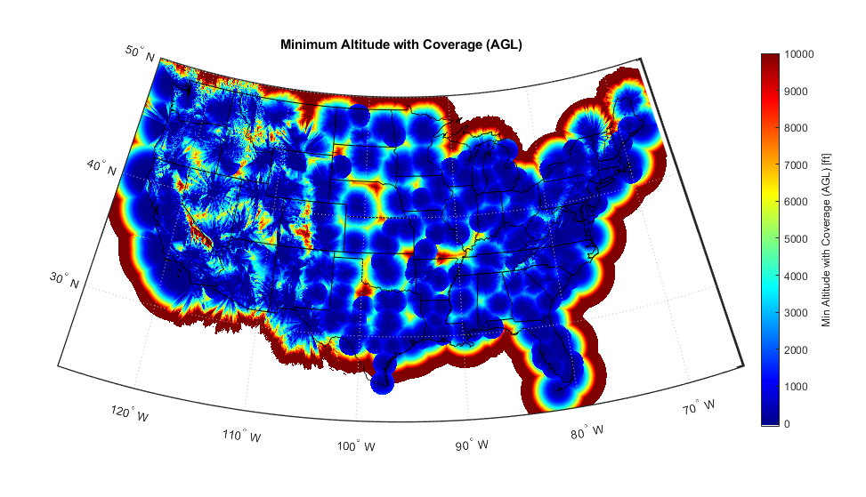
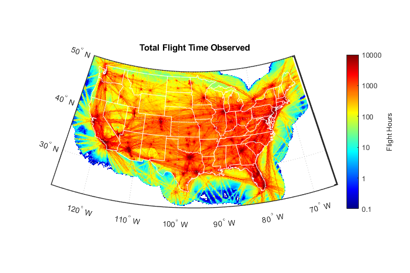
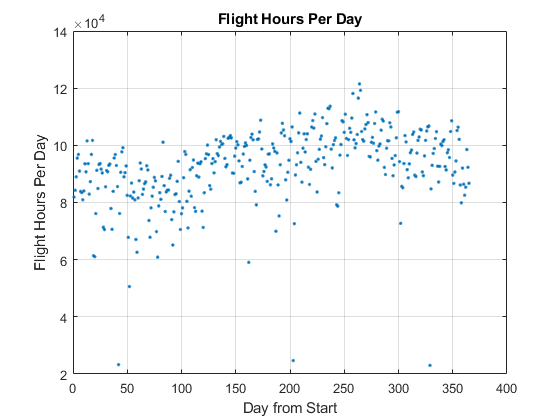
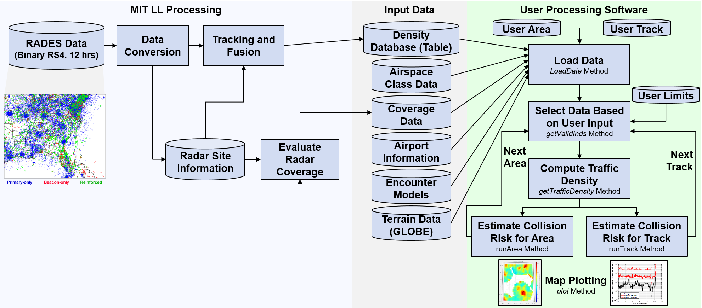
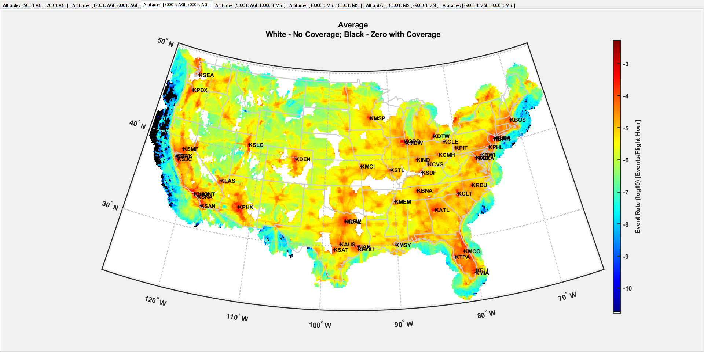
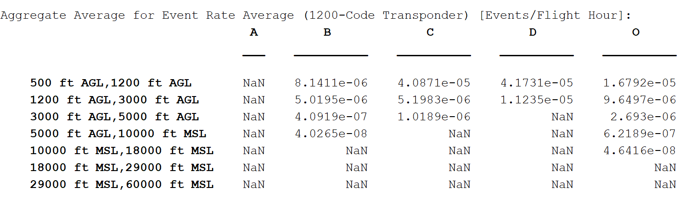

# Traffic Density Database Overview
This software is intended to process observed aircraft traffic information into unmitigated collision rates given user specified geographic regions or aircraft tracks. The user may also specify the time of day, month of year, and day of week to be evaluated. Unmitigated collision rates are useful for aircraft safety assessments, and may be combined with the efficacy of mitigations&mdash;e.g., air traffic control, detect and avoid, see and avoid&mdash;in order to estimate the total operation safety.

The traffic density data is extracted from raw air traffic and air defense radar data provided by the Air Force 84th Radar Evaluation Squadron. Over 300 long-range and short-range radars were used to generate the traffic data; the radar data is tracked and fused to ensure that traffic data is not duplicated (see Appendix F of [this document](https://www.ll.mit.edu/sites/default/files/publication/doc/2018-12/Kochenderfer_2008_ATC-344_WW-18099.pdf) for additional detail regarding this process). The fused data is then aggregated by temporally and spatially discretizing the traffic data. For each temporal and spatial cell, the total aircraft flight time and maximum instantaneous occupancy are captured; this software then estimates the traffic density and then the collision risk. The data files are provided separately on [Zenodo](https://zenodo.org/record/4317967#.X9Qd4dhKguU).

Although it is expected that collision rates are of primary interest, other event rates can be estimated given [user specified input parameters](#options). An event is when another aircraft comes within the user specified volume, and the event rate is the estimated average number of events per flight hour. For example, the event rate of near mid-air collisions (NMACs) typically defined as a loss of separation 500 ft horizontally and 100 ft vertically, may also be of interest.

## Contents
* [Application and Scope](#appscope)
* [Software Compatibility and Architecture](#softwarearch)
* [Initial Environment Setup](#initsetup)
* [Examples and Example Output](#examples)
* [Accessing Output Data](#output)
* [User Options](#options)
* [Testing](#testing)
* [Future Improvements](#improvements)
* [Citation](#citation)
* [Distribution Statement](#diststatement)

## <a name="appscope"></a> Application and Scope
This section describes key considerations when using this software, including limitations and assumptions. The following [sections](#softwarearch) describe how to setup and use the software.
<!-- Consider what other assumptions and limitations there might be  -->

### Radar Coverage Limitations
One of the main limitations of ground-based radars is the drop-off in minimum altitude surveilled as the range from the radar increases; additionally, there may be terrain obfuscations. The software accounts for these radar coverage limitations by inflating the traffic density proportional to the estimated coverage fraction in each spatial cell (although this can be disabled by the user), and presents such limitations to the user based on the user specified geographic region or aircraft track. The figure below indicates the estimated minimum altitude with radar coverage, represented in altitude Above Ground Level (AGL). Note that not all Air Traffic and Air Defense radars are included in the data set, so these data are not suitable for making any conclusions regarding national aggregate radar coverage. White areas in the figure have no radar coverage.



<!-- consider adding image of minimum AGL altitude estimated -->

### Unmitigated Collision Risk Estimation
The unmitigated collision risk is estimated directly from the traffic density by assuming that aircraft blunder into close encounters (as in [https://www.doi.org/10.2307/3007993](https://www.doi.org/10.2307/3007993)). This estimate also depends on the closing speed between conflicting aircraft and the aircraft physical size (aircraft are approximated as cylinders based on wing span and height). This approach to estimating the unmitigated collision risk is likely to be a reasonable estimate when there are limited mitigations before a close encounter occurs: when air traffic control intervention would be unlikely, and the effect of strategic separation is limited (e.g., away from airports). It may be possible to use the unmitigated collision risk estimates if these other mitigations are also accounted for: note however that it may not be straightforward to fully account for these mitigations&mdash;see the detailed discussion in [NATO AEP-101](https://nso.nato.int/nso/zPublic/ap/PROM/AEP-101%20EDA%20V1%20E.pdf). The unmitigated collision risk may also be reasonable when considering aircraft (such as small unmanned aircraft) operations that blunder into or through structured manned aircraft operations.

Air traffic control intervention depends on the type of aircraft operation, whether conducted under Instrument or Visual Flight Rules (IFR/VFR), and the Airspace Class (ICAO Annex 11, Air Traffic Services, 15th Edition, 2018). The source radar data reports do not contain whether the aircraft is IFR or VFR, but rather only include the transponder Mode A code. The Mode A code is assigned by air traffic control, and a discrete Mode A code indicates that an aircraft is receiving an air traffic service; this may include VFR aircraft that are receiving an air traffic service&mdash;e.g., control service, traffic information, or traffic avoidance advice. A 1200 Mode A code indicates that an aircraft is VFR and not receiving an air traffic service. When an aircraft track is specified by the user, the software provides an indication of the airspace class and whether the unmitigated collision rate estimate is considered reasonable for each track position.

The following table indicates the airspace classes where the unmitigated collision rate is expected to be reasonable based on the own aircraft (aircraft of interest) and intruder aircraft (surrounding environment)&mdash;i.e., where air traffic control services are not guaranteed, such that aircraft may blunder into close proximity. Transponders are required in Airspace Class A, B, and C (U.S. 14 CFR &#0167;91.215), so VFR in the table can be transponder equipped (1200-code) or noncooperative.

|        | Own Discrete           | Own VFR  |
| ------------- |:-------------:|:-------------:|
| **Intruder Discrete**      | G | D, E, G |
| **Intruder VFR**      | D, E, G      |   C, D, E, G |

<!-- Consider adding table noting in which airspace classes the unmitigated risk is appropriate, although this is already fairly verbose -->

### Consideration of Noncooperative Aircraft
Noncooperative data are not explicitly included in the input traffic density data, but rather are estimated as a fraction of the 1200 Mode A code VFR density (as an output from the _plot_ method). Noncooperative aircraft density is difficult to estimate because the primary radar data includes clutter (non-aircraft reports) and does not include aircraft altitude. The fraction is estimated from [FAA General Aviation and Part 135 Activity Surveys](https://www.faa.gov/data_research/aviation_data_statistics/general_aviation/). This assumption should be further validated.

### <a name="uncertainty"></a> Uncertainty Estimates
Observational data are subject to uncertainty&mdash;i.e., sampling from a population. In some cases, the observed aircraft flight time in a cell can be zero; this is exacerbated when the user narrowly specifies the temporal range (time of day, month, day of week). The number of aircraft within a given spatial and temporal cell is assumed to be Poisson, such that an associated confidence interval upper bound can be estimated. This confidence interval depends on the estimate itself, the confidence level, and the number of independent observations: both the confidence level (_cialpha_ property) and number of independent observations (_ciIndObsPerHr property_) are user configurable properties, but are assumed to be 95% and 10 independent observations per hour, respectively. The means for the user to access and display these estimates is described in the [Accessing Output Data Section](#output).

### <a name="datadescription"></a> 2018-2019 Data Description
The input data included with this release has the following attributes. See the [README](./Data/README.md) in the Data directory for more detail on the contents of each data file.

* The data span 8727 observed hours, from 4 November 2018 to 3 November 2019. Note that there are periods where there are no radar data available, so the data span does not correspond directly to the full date range extent.
* There are over 31.65 million flight hours observed (includes both discrete-code and 1200-code aircraft).
* The vertical spatial (height) discretization corresponds to standard altitude feature thresholds in the national airspace:
    * 100 ft Above Ground Level (AGL): Cutoff to exclude on-ground traffic
    * 500 ft AGL: nominal lower manned aircraft operating altitude
    * 1200 ft AGL: typical lower altitude for Class E airspace
    * 3000 ft AGL: approximate upper bound for Class D airspace
    * 5000 ft AGL: approximate upper bound for Class C airspace
    * 10,000 ft Mean Sea Level (MSL): typical Class B upper bound, and lower threshold for transponder requirements
    * 18,000 ft MSL: lower bound for Class A Airspace
    * 29,000 ft MSL: Reduced Vertical Separation Minimum (RVSM) lower altitude bound
    * 41,100 ft MLS: RVSM upper altitude bound
    * 60,100 ft MSL: upper bound for Class A Airspace
* The temporal discretization is 3 hours.
* The latitude range is 22.83&#0176;N to 50.00&#0176;N.
* The longitude range is 127.00&#0176;W to 64.83&#0176;W. (Note: Matlab indicates W longitude using negative numbers, e.g., 127.00&#0176;W is -127.00.)
* Two tables with different horizontal spatial discretization are provided: one for all altitudes, where the discretization is 1/6 of a degree in latitude and longitude (corresponding to approximately 10 NM); and one for altitudes below 5000 ft, where the discretization is 1/24 of a degree (approximately 2.5 NM). The table containing all altitudes is the default.

The following figure summarizes the total observed flight time for each horizontal cell (aggregated over altitude). For this particular figure, note that white areas indicate an observed flight time of less than 0.1 hours, but not necessarily that there is no radar coverage.



The figure below indicates the number of aircraft flight hours observed per day (from the starting date of 4 November 2018). From this view, source data dropouts can be observed.



Both figures are the default output of invoking the _SummarizeData_ method.

## <a name="softwarearch"></a> Software Compatibility and Architecture
This software has been tested on Windows and Linux operating systems, but is expected to work on Mac as well. The software has been tested on Matlab R2018b and newer: additionally, it requires the Matlab Mapping Toolbox and Statistics Toolbox. Using Matlab R2019a together with Matlab Coder will speed up some processing (in particular, computing the maximum traffic densities).

The software employs an object oriented architecture: the class is TrafficDensity (reference [Matlab objected oriented programming documentation](https://www.mathworks.com/discovery/object-oriented-programming.html) for syntax details). The architecture of the software is depicted in the figure below (green area at right). The user simply needs to instantiate a TrafficDensity object, set user configuration parameters as needed (e.g., specifying a geographic region or aircraft track), and then execute the process (using the _run_ method): see the [Examples Section](#examples) for software usage. The class methods will load the data, select the data that is consistent with the user specified properties (see [User Options](#options) below), estimate the traffic density and collision risk, and then plot the results. Because loading the data takes some time, it will only be loaded once (unless the object is cleared from memory).



The software utilizes Matlab's built-in documentation for custom classes, that converts embedded comments into readable documentation: to access such documentation, execute `doc TrafficDensity` in the Matlab command window (this command should be executed after running the startup script, as defined in the next section). The associated documentation will describe the object's properties (and whether they can be modified by the user) and methods (and whether they can be executed directly by the user). To access such information for a specific property or method, the user can type `help` or `doc` in the command window (to show information in the command window or help browser, respectively) followed by the object or class property&mdash;e.g., `help TrafficDensity.area`. The _plot_ method, which displays and provides output data, can be executed by the user any time after the _run_ method has completed.

_**Note:** Due to the large amount of data in the traffic density database, the user must have at least 18 GB of RAM on their machine in order to run the traffic density tool._

## <a name="initsetup"></a> Initial Environment Setup
After cloning this repository, the Data directory must be populated with the input data files described in the [Data directory README](./Data/README.md). The data files are provided separately on [Zenodo](https://zenodo.org/record/4317967#.X9Qd4dhKguU).

After the Data directory is populated, and any time that Matlab is restarted, the startup script in the top-level directory should be executed, which will check compatibility and setup the environment, including adding subdirectories to the path. It will also add the TrafficDensityDatabase path as an environment variable (TrafficDensityPath), which is used to access and save certain files.

## <a name="examples"></a> Examples and Example Output
The Examples directory contains several examples of invoking the software, from simple where the default configuration properties are used, to complex where many of the default properties are reconfigured. A new user should work through each example to familiarize themselves with the syntax and properties. The [README](./Examples/README.md) in the Examples directory contains a detailed description of each example provided.

The simplest way to invoke the software is to instantiate an object for the TrafficDensity class and then execute the processing using the _run_ method, for example:
```matlab
td = TrafficDensity; % Instantiate the object
td = td.run; % Evaluate the traffic density and estimate the collision risk
```
_**Note:** it is important to execute_ `td=td.run` _and not just_ `td.run` _in order for all of the data fields to be updated._

This simple execution will use all of the default properties and evaluate the collision risk for the entire geographic and temporal coverage of the input traffic density data. An example output figure showing the estimated collision risk for the combination of both 1200-code and discrete-code aircraft is below: the figure shows a single tab highlighting 3000-5000 ft AGL (note that the black text on the map indicates airports).



## <a name="output"></a>Accessing Output Data
It is recommended that access to processed data be through the _plot_ method, although it can also be accessed directly from the TrafficDensity object. The _plot_ method will additionally compute an estimate of noncooperative statistics (based on 1200-code estimates), combine estimates from the different transponder types, and cut off data that is outside user specified latitude, longitude, and altitude properties. Types of output data that are available include estimated counts, densities, and event rates for each cell:
* Cell Count: number of aircraft in the cell [unit: AC]
* Cell Density: aircraft count normalized by the cell volume [unit: AC/NM<sup>3</sup>]
* Event Rate: estimated frequency of aircraft coming within user specified event volume for each cell [unit: event/own flight hour]

For each type of data, there are several summary statistics that are available:
* Average: the average spatial cell flight time over the temporal cells specified by the user.
* Maximum Average: the maximum spatial cell flight time over the temporal cells specified by the user.
* Maximum Occupancy: the maximum instantaneous aircraft occupancy observed over the temporal cells specified by the user.
* Average Upper Bound: the confidence interval upper bound for the Average.
* Standard Deviation: standard deviation of the average.

The first three columns of the table below define the output data properties: the main property is in parentheses, and the subproperty is that in the table cells. As an example, to access the average event rate from a class object `td` as in the example above, the user could access the property as `output = td.rate.rateavg`. Using the plot method, the same data can be accessed as `output = td.plot('plottype','rate','plotvalue','avg')`; note that the event rate and average are the _plot_ method defaults, so for this specific case, this is equivalent to `output = td.plot`. The fourth column of the table shows the `plotvalue` option for each metric type. See `plot.m` for all available `plottype` options.

|        | Cell Count (count) | Cell Density (density) | Event Rate (rate) | _Plot_ Method `plotvalue` Option |
| ------------- |:-------------:|:-------------:|:-------------:|:-------------:|
| Average     | c | rho | rateavg | avg |
| Maximum Average      | cmax      |  rho_max | ratemax | max |
| Maximum Occupancy      | cmaxocc      |   rho_max_occ | ratemaxocc | maxocc |
| Average Upper Bound      | cub      |   rhoub | rateavgub | avgupperbound |
| Standard Deviation      | cstd      |   rho_std | ratestd | std |

Note that the main properties (count, density, rate) in both the TrafficDensity class and _plot_ method outputs are structure arrays, with each index representing a different type of transponder:
1. Discrete-code transponder
2. 1200-code transponder
3. Noncooperative estimate
4. Aggregate aircraft &mdash; includes 1 (discrete-code) and 2 (1200-code). Optionally includes 3 (noncooperative estimate), if `processNoncoop` property is enabled.

Options 3 and 4 are only available in the _plot_ method output, and they are disabled by default; option 3 can be enabled through a property in the TrafficDensity object (e.g., `td.processNoncoop=true`), and option 4 can be enabled through (Name,Value) syntax to the _plot_ method, such as `output = td.plot('plotcombined',true)` (this particular example would plot the default event rate and average since the _plottype_ and _plotvalue_ options are not specified).

When processing a geographic area, the _plot_ method will return a second output that summarizes the data based on airspace class and altitude bin; the _summarizearea_ input option must be enabled (it is enabled by default). This will also plot a summary of these estimates to the command window. Example summary statistics are shown below. Each row corresponds to a different altitude bin. Each column corresponds to a different airspace class&mdash;O stands for "Other" and can be E or G airspace.



## <a name="options"></a> User Options
Users can adjust the behavior of the software and output using a variety of class properties. The user can access and modify the properties using standard Matlab syntax in the command window or in a function or script&mdash;e.g., `oldValue = object.property`, `object.property=newValue`. Input error checking is employed to help ensure that the inputs are valid. Specific user configurable properties include:

### Geographic Properties
* area: defines a limited rectangular area in terms of latitude and longitude. See [area specification example](./Examples/simpleExampleArea.m) for syntax.
* track: defines an aircraft track of interest. See [track specification example](./Examples/simpleExampleTrack.m) for syntax.
* processtrack: boolean flag that indicates whether the track or area should be processed (a value of true is to process the track rather than the area). When the area or track properties are modified, the flag is updated automatically, but this can be overridden by the user.

### Temporal Constraints
For temporal properties, the default is to not be specified (an empty array) which indicates no constraints.
* timeofday: specify the temporal bin, defined in terms of UTC (for the 2018-2019 data there are 8 equal size bins per day, equating to 3 hours each). This is a 0-based index so 0 is the first bin.
* monthofyear: specify the calendar month (1-12 where 1 is January).
* dayofweek: specify the day of the week (1-7 where 1 is Sunday).
* height: specify the altitude bin as a 0-based index where 0 is the lowest altitude bin. See [data description](#datadescription) for the altitude bins used.

### Aircraft Type and Characteristics
In general, the first value/index is for discrete code and the second is 1200-code, but the user is cautioned that 0- and 1-based indexing may be used based on the context.
* ACcategory: whether to process discrete (0) and/or 1200-code (1) density (when not specified/empty, the software will process both aircraft types).
* processNoncoop: whether to process noncooperative estimates from the 1200-code traffic density (note that this only affects the outputs from the _plot_ method).
* noncoopFactor: relative fraction of noncooperative to 1200-code counts, density, and rates (0.23 by default).
* ownspeed: own aircraft true airspeed to use when estimating the collision risk for a geographic area [kts]. Can be a scalar or a vector with the number of elements equal to the number of altitude bins. If undefined, will use the average from the encounter model ([see here](https://github.com/Airspace-Encounter-Models/em-overview) for a description of encounter models).
* macR and macH: collision cylinder dimensions (radius and height, respectively) used for computing the collision risk [ft]. These represent the assumed intersection of cylinders centered on each aircraft. They are the sum of the half wing spans for the two aircraft, and sum of the half height for the two aircraft, respectively. The defaults are based on an RQ-4A Global Hawk and a Beechcraft King Air: macR is 83.2 ft and macH is 14.4 ft. The dimensions can be changed to represent other events of interest, such as NMAC, where macR would be set to 500 ft and macH would be set to 100 ft.

### Output Options
* plotresults: whether to plot results (true - yes) [default: true].
* plotAirport: whether to plot local airports (true - yes) [default: true].
* plotMaxNAirport: maximum number of airports to plot [default: 50]. If this value is less than the total number of airports in the plotted geographic area, then airports are selected based on higher annual commercial operations.
* computestd: whether to compute the standard deviation of the average (note that this takes some time to process) (true - yes) [default: false].
* verbose: whether to provide output to the command window regarding processing status and output data (true - yes) [default: true].
* cialpha: alpha parameter (confidence level) for confidence interval computation (see [Uncertainty Estimates description above](#uncertainty)) [default: 0.05].
* ciIndObsPerHr: assumed number of independent observations per hour for confidence interval computation (see [Uncertainty Estimates description above](#uncertainty)) [default: 10].

### Radar Coverage Correction
* correctcoverage: boolean flag to indicate whether partial cell radar coverage should be corrected by normalizing the density by the estimated fraction of the cell that has coverage (true - yes).
* noCoverageThreshold: fractional coverage threshold below which a cell is assumed to have no coverage.

To disable both options, set correctcoverage to false and noCoverageThreshold to 0.

## <a name="testing"></a> Testing
The Testing directory contains unit tests (and associated test data) for verifying the tool's core functionalities. See the [README](./Testing/README.md) in the Testing directory for more detail on each test.

## <a name="improvements"></a> Future Improvements
Suggested improvements to the tool include:
* Validation of assumption that noncooperative traffic density is directly proportional to the 1200-code density (and associated correction factor).
* Extrapolating observed data to locations without radar coverage.

## <a name="citation"></a> Citation

Please use this DOI number reference when citing the software:

[](https://zenodo.org/badge/latestdoi/320663889)

Please use this DOI number reference when citing the data:

[](https://doi.org/10.5281/zenodo.4317967)

## <a name="diststatement"></a> Distribution Statement
DISTRIBUTION STATEMENT A. Approved for public release. Distribution is unlimited.

This material is based upon work supported by the National Aeronautics and Space Administration under Air Force Contract No. FA8702-15-D-0001. Any opinions, findings, conclusions or recommendations expressed in this material are those of the author(s) and do not necessarily reflect the views of the National Aeronautics and Space Administration.

© 2019-2020 Massachusetts Institute of Technology.

Delivered to the U.S. Government with Unlimited Rights, as defined in DFARS Part 252.227-7013 or 7014 (Feb 2014). Notwithstanding any copyright notice, U.S. Government rights in this work are defined by DFARS 252.227-7013 or DFARS 252.227-7014 as detailed above. Use of this work other than as specifically authorized by the U.S. Government may violate any copyrights that exist in this work.
